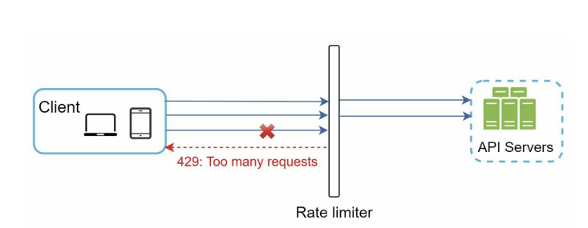
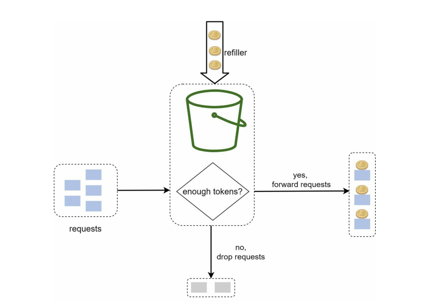
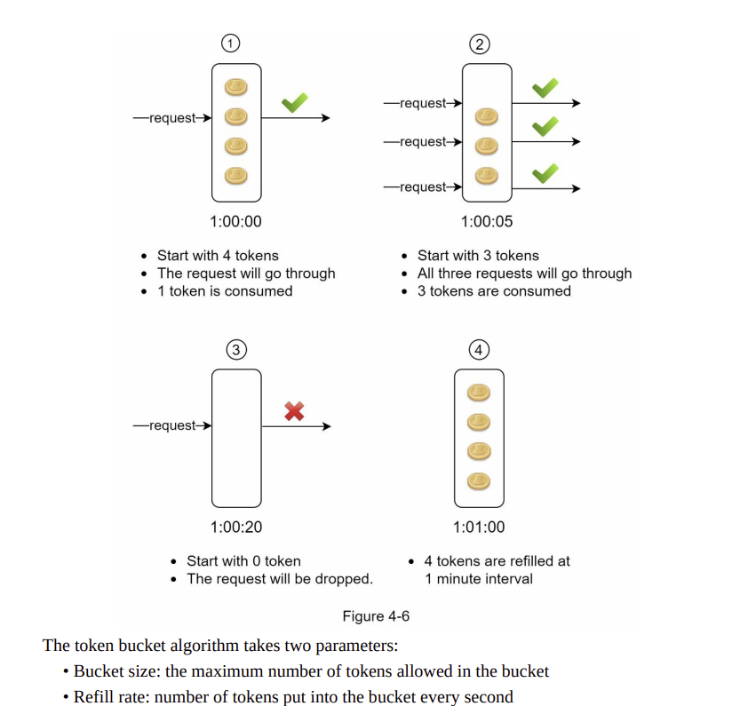
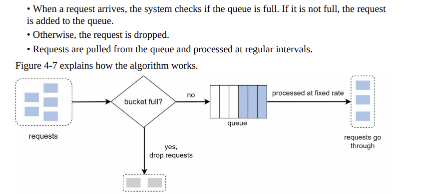

Perfect — here's the updated **README** with:

- ✅ High-level architecture
- 🧠 Token Bucket & Leaky Bucket explanations
- 🧪 In-memory implementations
- 🚀 Flask and FastAPI usage
- 📜 Full Python **algorithm implementations** included

---

### 📄 `README.md`

```markdown
# 🚦 Distributed Rate Limiter in Python
A fast, memory-efficient, and fault-tolerant **rate limiter** with:

- ✅ Token Bucket & Leaky Bucket algorithms
- 🧠 In-memory fallback (no Redis required)
- ⚡ Integration with Flask or FastAPI
- 🌐 Distributed support (via Redis)

---

## 📐 High-Level Architecture

```text
+-------------------------+
|     HTTP API Server     |
|  (Flask / FastAPI App)  |
+-----------+-------------+
            |
            v
+-------------------------+
|      Rate Limiter       |
| (Token / Leaky Bucket)  |
+-----------+-------------+
            |
        +---+---+
        | Redis |
        +-------+
        (Optional: for distributed sharing)
```



---

## 🧠 Algorithms

### 🪙 Token Bucket

- Bucket holds up to `capacity` tokens.
- Tokens refill at a constant rate (`refill_rate`).
- If enough tokens, request is allowed.
- If not, the request is denied.






### 🚰 Leaky Bucket

- Incoming requests are "water drops" into a bucket.
- The bucket leaks at a steady rate (`leak_rate`).
- If water level exceeds `capacity`, request is denied.



---

## 🧪 In-Memory Token Bucket Implementation

```python
# in_memory_token_bucket.py
import time

class InMemoryTokenBucket:
    def __init__(self, capacity, refill_rate):
        self.capacity = capacity
        self.refill_rate = refill_rate
        self.tokens = {}
        self.timestamps = {}

    def allow_request(self, identifier):
        now = time.time()
        tokens = self.tokens.get(identifier, self.capacity)
        last_refill = self.timestamps.get(identifier, now)

        # Refill tokens based on elapsed time
        new_tokens = min(self.capacity, tokens + (now - last_refill) * self.refill_rate)
        if new_tokens < 1:
            return False  # Not enough tokens

        self.tokens[identifier] = new_tokens - 1
        self.timestamps[identifier] = now
        return True

```

---

## 🧪 In-Memory Leaky Bucket Implementation

```python
# in_memory_leaky_bucket.py
import time

class InMemoryLeakyBucket:
    def __init__(self, capacity, leak_rate):
        self.capacity = capacity
        self.leak_rate = leak_rate
        self.water_level = {}
        self.last_checked = {}

    def allow_request(self, identifier):
        now = time.time()
        level = self.water_level.get(identifier, 0)
        last_time = self.last_checked.get(identifier, now)

        # Leak out old water
        leaked = (now - last_time) * self.leak_rate
        level = max(0, level - leaked)

        if level + 1 > self.capacity:
            return False

        self.water_level[identifier] = level + 1
        self.last_checked[identifier] = now
        return True
```

---

## 🚀 Flask Integration Example

```python
# flask_app.py
from flask import Flask, request, jsonify
from in_memory_token_bucket import InMemoryTokenBucket

app = Flask(__name__)
rate_limiter = InMemoryTokenBucket(capacity=5, refill_rate=1)

@app.route("/api")
def api():
    user_id = request.args.get("user", "anonymous")
    if rate_limiter.allow_request(user_id):
        return jsonify({"message": "✅ Request allowed"})
    return jsonify({"error": "⛔ Rate limit exceeded"}), 429

if __name__ == "__main__":
    app.run(debug=True)
```


---

## ⚠️ Notes

- In-memory mode is best for **testing** or **local dev**.
- For **distributed use**, integrate with Redis (example available upon request).
- Easily extend to IP-based throttling, API keys, or user-specific limits.

---

## 🧑‍💻 Author

OriginalHybrid

---

## 📚 References

- [Token Bucket](https://en.wikipedia.org/wiki/Token_bucket)
- [Leaky Bucket](https://en.wikipedia.org/wiki/Leaky_bucket)
```